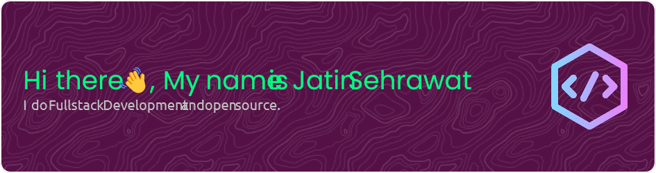

<!-- <a href="https://jatinseh.dev"></a> -->

## <a href="https://emoji.gg/emoji/5498_catJAM"></a> Hi, Welcome!

```
                   YAao,
                    Y8888b,
                  ,oA8888888b,
            ,aaad8888888888888888bo,
         ,d888888888888888888888888888b,
       ,888888888888888888888888888888888b,
      d8888888888888888888888888888888888888,
     d888888888888888888888888888888888888888b
    d888888P'                    `Y888888888888,
    88888P'                    Ybaaaa8888888888l
   a8888'                      `Y8888P' `V888888
 d8888888a                                `Y8888
AY/'' `\Y8b                                 ``Y8b
Y'      `YP                                    ~~
         `'
```
### <a href="https://emoji.gg/emoji/4014-subaruduckdance"></a>About me 
-  🧠  I'm currently an intern.
-  📕  Persuing Master's in Computer Science (2022 - 2024) from University of Delhi.
-  💬  Always interested in new and innovative technologies.
-  📧  Ask me anything, [here](https://github.com/jatinsehrwt/jatinsehrwt/discussions/categories/general).

>  🎀 Light Mode attracts bugs.

### <a href="https://emoji.gg/emoji/3581-cat-dead"></a> Daily Quotes

__ Work in progress __

<!-- ### My GitHub Stats -->
<!--  -->

<!-- [](https://github.com/jatinseh/goomba) -->

<!-- [](https://github.com/jatinseh/goomba)  [](https://github.com/jatinseh/goomba)  
 -->
~ [jsehrwt.com](https://www.jsehrwt.com)  

<!--
**jatinseh/jatinseh** is a ✨ _special_ ✨ repository because its `README.md` (this file) appears on your GitHub profile.

Here are some ideas to get you started:

- 🔭 I’m currently working on ...
- 🌱 I’m currently learning ...
- 👯 I’m looking to collaborate on ...
- 🤔 I’m looking for help with ...
- 💬 Ask me about ...
- 📫 How to reach me: ...
- 😄 Pronouns: ...
- ⚡ Fun fact: ...
-->
